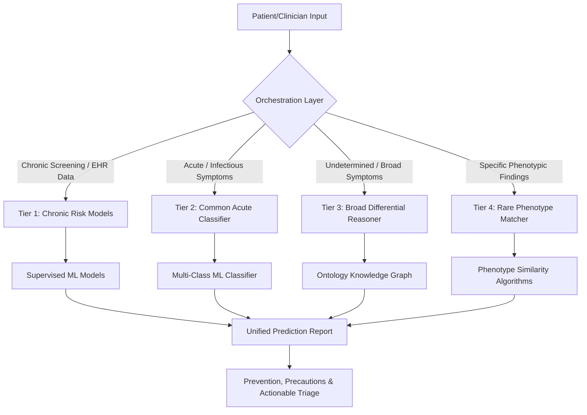

# Disease Prediction & Triage Pipeline Architecture

This document outlines the complete workflow of the Universal Disease Prediction Platform—from initial patient input to tier classification, model execution, and final outputting of clinical/prevention guidance.

---

## End-to-End Data & Decision Flow

---

## 1. Patient Input Ingestion
The system accepts patient data through two main interfaces:
*   **Patient Intake App:** A mobile/web interface where patients enter demographics, answer structured symptom questionnaires, or describe symptoms in plain text.
*   **Clinician Workbench / EHR Integration:** Ingests structured EHR data (FHIR format), laboratory results, vitals history, and physician-entered diagnostic codes.

---

## 2. Tier Classification Logic
The **Orchestration Layer** dynamically routes the input data (or segments of it) to the appropriate specialized tier:

1.  **Tier 1 Route:** Triggered automatically when structured health profiles (vitals, demographics, labs) are ingested, or when a clinician/patient explicitly requests a chronic disease screening.
2.  **Tier 2 Route:** Triggered when the patient inputs acute, short-duration symptoms (e.g., cough, fever, sore throat, rash).
3.  **Tier 3 Route:** Evaluated in parallel or as a fallback when symptoms are non-specific, long-standing, or do not map to common Tier 1/2 diseases, scanning a broad database of thousands of diseases.
4.  **Tier 4 Route:** Triggered when a specialist inputs detailed phenotype terms (HPO codes) or when a patient presents with a chronic, undiagnosed condition that has failed standard Tier 1-3 triage.

---

## 3. Detailed Tier Processing & Methodologies

### Tier 1: Chronic Disease Risk Models
*   **Train a model?** Yes. We train supervised machine learning models (e.g., XGBoost, LightGBM, or Deep Neural Networks) for each specific high-burden chronic disease.
*   **Primary Datasets:** 
    *   [CDC NHANES](https://www.cdc.gov/nchs/nhanes/) (National Health and Nutrition Examination Survey)
    *   [UCI Heart Disease / Kidney Disease](https://archive.ics.uci.edu/datasets)
    *   [Kaggle BRFSS Diabetes Indicators](https://www.kaggle.com/datasets/alexteboul/diabetes-health-indicators-dataset)
    *   [MIMIC-IV EHR](https://physionet.org/content/mimiciv/) (De-identified hospital clinical records)
*   **Important Features/Parameters:**
    *   *Demographics:* Age, Biological Sex, Race/Ethnicity.
    *   *Biometrics & Vitals:* Body Mass Index (BMI), Blood Pressure (Systolic & Diastolic).
    *   *Clinical Labs:* HbA1c/Fasting Glucose, Lipid Profile (LDL, HDL, Total Cholesterol), Serum Creatinine, eGFR.
    *   *Lifestyle & History:* Smoking Status, Physical Activity Level, Alcohol Intake, Family History of disease.
*   **Prevention & Precaution Steps Taken:**
    *   Calculates a calibrated risk score (%) and assigns a risk category (Low, Moderate, High).
    *   Maps risk levels to standard clinical guidelines (e.g., USPSTF, ADA).
    *   Generates lifestyle modifications (dietary changes, target activity) and clinical screening schedules (e.g., "Schedule a lipid panel in 6 months").

---

### Tier 2: Common Acute & Infectious Classifiers
*   **Train a model?** Yes. A multi-class classifier model (e.g., XGBoost, CatBoost, or a fine-tuned clinical-BERT transformer) is trained to map combinations of symptoms to common acute diagnoses.
*   **Primary Datasets:**
    *   [DDXPlus Dataset](https://github.com/mila-iqia/ddxplus) (1.3M+ synthetic clinical cases mapping symptoms to 49 common diseases)
    *   [CDC FluView](https://www.cdc.gov/flu/weekly/) (For seasonal and regional epidemiological priors)
*   **Important Features/Parameters:**
    *   *Presenting Symptoms:* Multi-select array of symptoms (e.g., fever, cough, fatigue, joint pain, nausea).
    *   *Symptom Attributes:* Severity (mild/mod/severe), duration (days/weeks), onset pattern (sudden vs. gradual).
    *   *Temporal & Environmental:* Current month/season, recent travel history, local outbreak data.
*   **Prevention & Precaution Steps Taken:**
    *   Generates a ranked list (top-5 differential diagnosis) with model confidence.
    *   Outputs immediate triage advice (e.g., **Self-care**, **Schedule PCP visit**, **Go to Urgent Care**, **Emergency Room**).
    *   Includes safety precautions: independent red-flag detection (e.g., chest pain, shortness of breath) that immediately bypasses the classifier and tells the patient to seek emergency care.

---

### Tier 3: Broad Differential Reasoner
*   **Train a model?** No. Uses ontology/knowledge-graph traversal combined with a probabilistic ranking engine (e.g., Bayesian network) rather than training supervised models, because data is too sparse for thousands of rare or uncommon conditions.
*   **Primary Datasets / Ontologies:**
    *   [SNOMED CT](https://www.snomed.org/) (Clinical terminology framework)
    *   [ICD-10-CM / ICD-11](https://www.who.int/standards/classifications/classification-of-diseases) (International Disease Classification)
    *   [UMLS](https://uts.nlm.nih.gov/) (Unified Medical Language System to map synonyms across ontologies)
*   **Important Features/Parameters:**
    *   Structured symptoms and clinical findings mapped to ontology codes.
    *   Co-morbidities and historical diagnoses.
*   **Prevention & Precaution Steps Taken:**
    *   Generates a broad differential list tagged with evidence levels (High, Medium, Low evidence).
    *   Suggests recommended confirmatory laboratory tests or imaging orders to rule out the top differential candidates.
    *   Lists key contraindications based on the candidate conditions.

---

### Tier 4: Rare & Genetic Disease Phenotype Matcher
*   **Train a model?** No. Uses semantic similarity algorithms (e.g., Jaccard similarity, Resnik information content, or BOQA—Bayesian Ontology Query Algorithm) to compare patient symptoms to reference disease profiles.
*   **Primary Datasets / Ontologies:**
    *   [HPO](https://hpo.jax.org/) (Human Phenotype Ontology - 18,000+ clinical finding terms)
    *   [Orphanet](https://www.orpha.net/) (Database of 7,000+ rare diseases)
    *   [OMIM](https://www.omim.org/) & [ClinVar](https://www.ncbi.nlm.nih.gov/clinvar/) (Genetic variation & phenotype database)
*   **Important Features/Parameters:**
    *   A set of HPO-coded patient phenotype terms (e.g., *HP:0001324: Muscle weakness*, *HP:0001250: Seizures*).
    *   Genomic variant reports (if available, ClinVar annotation files).
*   **Prevention & Precaution Steps Taken:**
    *   Generates a ranked candidate list of matching rare syndromes.
    *   Explains exactly which patient phenotypes overlap with the candidate disease.
    *   Provides pathways for specialist clinical referrals (e.g., Medical Genetics) and access to genetic counseling resources.
